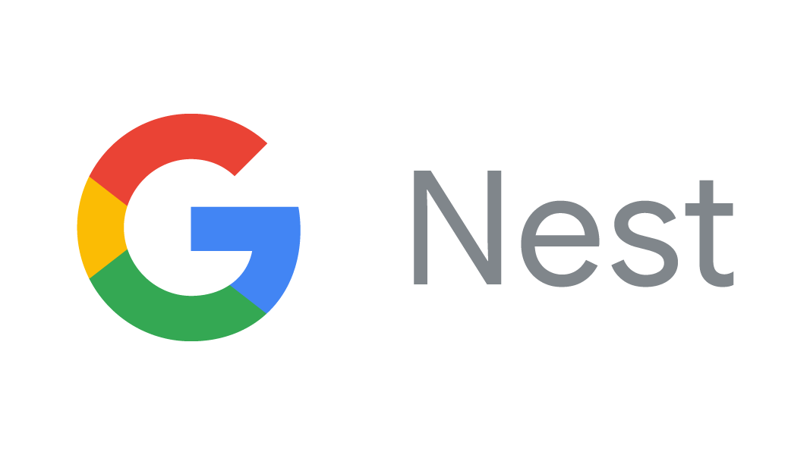
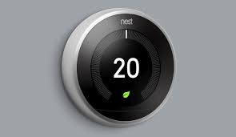
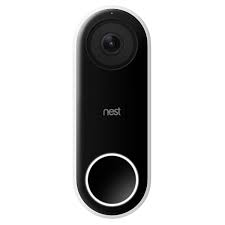

# NestDeviceAccess Binding

This binding integrates Nest products through the [Google Smart Device Management (SDM) API](https://developers.google.com/home/smart-device-management).

_If possible, provide some resources like pictures, a YouTube video, etc. to give an impression of what can be done with this binding. You can place such resources into a `doc` folder next to this README.md._

## Supported Things

The NestDeviceAccess Binding will support things allowed by the Google Smart Device Management (SDM) API. Currently
the binding implements the Thermostat and device traits for Nest products defined at the [SDM traits](https://developers.google.com/nest/device-access/traits).

Thermostat Trait - Currently supported (Tested against generation 2 and 3 Nest Thermostats)

Doorbell Trait - Currently in testing

Camera Trait - (Needs to be implemented)

## Discovery

The NestDeviceAccess binding works through discovery by leveraging the Google SDM API to perform a devices trait call to get all devices allowed by the accessToken. The devices are then enumerated to identify the "Type" of device. If it is a Thermostat or Doorbell "Type" then the device will be added to the inbox.

Once added to the inbox, the device can be added as a thing. The thing will import several default properties to allow communication with the SDM API. 

Note: You MUST configure the discovery service through the services/cfg folder.. The format is listed under the BINDING CONFIGURATION section of this document. The file must be named nestdeviceaccess.cfg
## Binding Configuration

'# Configuration for the Nest Device Access Binding
#
'# There is general project information for Google that must be provided in order to discover Nest products
'# The configuration data is a per project configuration and can be changed by the user.
'# A sandbox project created by Brian Higginbotham @BHigg was created and listed below for testing purposes only
'# Use the project at your own risk for testing or create your own project through Google and enable the SDM APIs for individual use.
'# Google Pubsub properties added for Doorbell eventing capabilities. You will need to enable a PubSub in your google project and tie a service account with view access to the pubsub subscription and topic that are created. More instructions can be found on Google's website.
'# Note this project is limited in nature as a sandbox project to 30 API calls/min by Google.
'#
'#
'#projectId is the Google project provided through the project creation process
projectId=<list projectId here>

'#clientId is the Google clientId for your application
clientId=<list clientId here>

'#clientSecret is the Google clientSecret used to fetch the initial and refresh accessTokens
clientSecret=<list clientSecret here>

'#authorizationToken is used to authorize your devices with the project and provide the user with a unique refresh and first time access token.
authorizationToken=<list authorizationToken here>

'#refreshToken is used to get accessTokens from the application
refreshToken=<list refreshToken here>

'# NEW PROPERTIES for the Google Pubsub configurations. Optional for Thermostat. Mandatory for Doorbell and Camera

'#ServiceAccount information that is used to get pubsub information
serviceAccountPath=

'#SubscriptionId for the PubSub that was enabled.. This is a named value when creating the pubsub subscription
subscriptionId=

'#pubsubProjectId is a project identifier that was provided to you when creating the pubsub.. ex openhab-nest-int-XXXXXXXXXX
pubsubProjectId=

## Thing Configuration

refreshInterval is used to tell the thing to refresh status (in seconds) and is required.

## Channels

| channel          | type   | description                         |
|------------------|--------|-------------------------------------|
|-------- Thermostat Thing----------------------------------------|
| thermostatName                | Text                   | This is the name of the Thermostat  |
| thermostatHumidtyPercent      | Number:Length          | This is the Humidity Percentage     |
| thermostatAmbientTemperature  | Number:Dimensionless   | This is the ambient Temperature                         |
| thermostatTemperatureCool     | Number:Dimensionless   | This is the Cool Temperature Reading for the Thermostat (Only valid for Cool and Heat-Cool)|
| thermostatTemperatureHeat     | Number:Dimensionless   | This is the Heat Temperature Reading for the Thermostat (Only valid for Heat-Cool and Heat)|
| thermostatCurrentMode         | Text                   | This is the current mode of the HVAC
| thermostatCurrentEcoMode                               | Text   | This is the current mode of the Eco Setting for HVAC
| thermostatTargetTemperature   | Number:Dimensionless   | This is a aggregate temperature setting for the thermostat (Only valid for Heat and Cool)
| thermostatMinTemperature      | Number:Dimensionless   | This is a setting used for Eco and Heat-Cool HVAC Mode
| thermostatMaxTemperature      | Number:Dimensionless   | This is a setting used for Eco and Heat-Cool HVAC Mode
| thermostatScaleSetting        | Text                   | This is the Scale setting for the Thermostat (FAHERNHEIT or CELSIUS)
| ----------------------------------------------------------------|
|--------- Doorbell Thing-----------------------------------------|
|doorbellSoundEventImage             | Image                  | This is a generated image based on a Sound event. The event has an event ID that is required to generate the image. |
|doorbellMotionEventImage             | Image                  | This is a generated image based on a Motion event. The event has an event ID that is required to generate the image. |
|doorbellPersonEventImage             | Image                  | This is a generated image based on a Person event. The event has an event ID that is required to generate the image. |
|doorbellChimeEventImage             | Image                  | This is a generated image based on a Chime event. The event has an event ID that is required to generate the image. |
| doorbellChimeLastEventTime    | Text                   | This is the time a door Chime event was last received |
| doorbellChimeEvent            | Switch                 | This is a switch that flips when a Chime event is received |
| doorbellPersonEvent           | Switch                 | This is a switch that flips when a Person event is received |
| doorbellPersonLastEventTime   | Text                   | This is the time a Person was detected by the doorbell |
| doorbellMotionEvent           | Switch                 | This is a switch that flips when a Motion event is received |
| doorbellMotionLastEventTime   | Text                   | This is the time a Motion event was last received |
| doorbellSoundEvent            | Switch                 | This is a switch that flips when a Sound event is received |
| doorbellSoundLastEventTime    | Text                   | This is the time a Sound event was last received |
| doorbellLiveStreamUrl         | Text                   | This is the generated Live Stream URL when a motion is detected. Note: The URL includes a token that can be used to view an rtsps stream..|
| doorbellLiveStreamExpirationTime | Text                | This is the Live Stream Expiration time when the token and URL must be generated again |
| doorbellLiveStreamExtensionToken | Text                | This is the Live Stream Extension Token that is used to request an extension to the initial LiveStreamUrl embedded Token. |
| doorbellLiveStreamCurrentToken   | Text                | This is the Live Stream Current Token that is embedded in the LiveStreamURL. |
|-----------------------------------------------------------------|

## Full Example

#Demo.sitemap
Frame label="Dining Room Thermostat" icon="temperature"{
            Switch item=NestDiningRoomThermostat_CurrentMode label="HVAC Mode" mappings=[OFF="OFF",COOL="COOL",HEAT="HEAT",HEATCOOL="HEATCOOL"] icon="climate"                  
            Text item=NestDiningRoomThermostat_AmbientTemperature label="Current Ambient Temperature" icon="temperature"
            Text item=NestDiningRoomThermostat_HumidityPercentage label="Current Humidity" icon="humidity"                  
            Setpoint item=NestDiningRoomThermostat_TargetTemperatureSetting label="Target Temperature [%d]" minValue=65 maxValue=80 step=1 visibility=[NestDiningRoomThermostat_CurrentMode=="COOL",NestDiningRoomThermostat_ScaleSetting=="FAHRENHEIT"]      
}

Text label="Front Door" icon="door"{
        Frame label="Doorbell" icon="door"{
            Switch item=NestFrontDoorDoorbell_Has_Chime label="Has Chime" mappings=[OFF="OFF",ON="ON"]
            Image item=NestFrontDoorDoorbell_ChimeEventImage label="Front Door Image" visibility=[NestFrontDoorDoorbell_Has_Chime=="ON"]                        
            Text item=NestFrontDoorDoorbell_ChimeLastEventTime label="Last Chime Event Time" visibility=[NestFrontDoorDoorbell_Has_Chime=="ON"]            
            Switch item=NestFrontDoorDoorbell_Has_Sound label="Has Sound" mappings=[OFF="OFF",ON="ON"]
            Image item=NestFrontDoorDoorbell_SoundEventImage label="Front Door Image" visibility=[NestFrontDoorDoorbell_Has_Sound=="ON"]                        
            Text item=NestFrontDoorDoorbell_SoundLastEventTime label="Last Chime Event Time" visibility=[NestFrontDoorDoorbell_Has_Sound=="ON"]            
            Switch item=NestFrontDoorDoorbell_Has_Motion label="Has Motion" mappings=[OFF="OFF",ON="ON"]                        
            Image item=NestFrontDoorDoorbell_MotionEventImage label="Front Door Image" visibility=[NestFrontDoorDoorbell_Has_Motion=="ON"]                      
            Text item=NestFrontDoorDoorbell_MotionLastEventTime label="Last Motion Event Time" visibility=[NestFrontDoorDoorbell_Has_Motion=="ON"]            
            Switch item=NestFrontDoorDoorbell_Has_Person label="Has Person" mappings=[OFF="OFF",ON="ON"]                        
            Image item=NestFrontDoorDoorbell_PersonEventImage label="Front Door Image" visibility=[NestFrontDoorDoorbell_Has_Person=="ON"]                      
            Text item=NestFrontDoorDoorbell_PersonLastEventTime label="Last Motion Event Time" visibility=[NestFrontDoorDoorbell_Has_Person=="ON"]            
            Text item=NestFrontDoorDoorbell_LiveStreamExpiration label="Live Stream Expiration"
            Text item=NestFrontDoorDoorbell_LiveStreamUrl label="Live Stream URL"
            Text item=NestFrontDoorDoorbell_LiveStreamExtensionToken label="Live Steam Extension Token"
            Text item=NestFrontDoorDoorbell_LiveStreamCurrentToken label="Live Steam Token"
        }
    }

## Any custom content here!

The NestDeviceAccess Binding is built with a sandbox project in Google. This means that there is a limit of 30 requests to the API/min. This is used for testing. However, if you switch the services/nestdeviceaccess.cfg configuration for the binding to use a different projectId and clientId, you can use this binding on a better project.

To configure the discovery service, you must place a nestdeviceaccess.cfg in the services dir <eg etc/openhab2/services/nestdeviceaccess.cfg>

You only need either the authorizationToken or refreshToken. If you use the authorizationToken, the binding will fetch your refreshToken and add it to the openhab log file (Make sure you update the nestdeviceaccess.cfg file with your refreshToken.) Otherwise, go through the linked instructions below and get your refreshToken and update the nestdeviceaccess.cfg file. 

It is pretty easy to see if the nest discovery works, if the parameters are in the nestdeviceaccess.cfg file, when you go to the inbox and try to add a NestDeviceAccess thing, it will start the discovery. Otherwise, it will ask for the parameters manually.

Make sure you follow the instructions on [Google Nest Authorization instructions](https://developers.google.com/nest/device-access/authorize) in order to get your initial Authorization and Refresh token. You can store those in the nestdeviceaccess.cfg file for configuration of the discovery service.

If you have a doorbell/camera or want to utilize the eventing capability for devices, including thermostats, then you need to setup a Pubsub in your Google projects. [Google PubSub Creation](https://developers.google.com/nest/device-access/subscribe-to-events)

I've included a sample project projectId, clientId, and clientSecret in the nestdeviceaccess.cfg for testing purposes only. You can get the authorizationToken per the above instructions and I will output your refreshToken and initial accessToken in the openhab.log file. You will need to update the nestdeviceaccess.cfg file with this data after initial usage.

